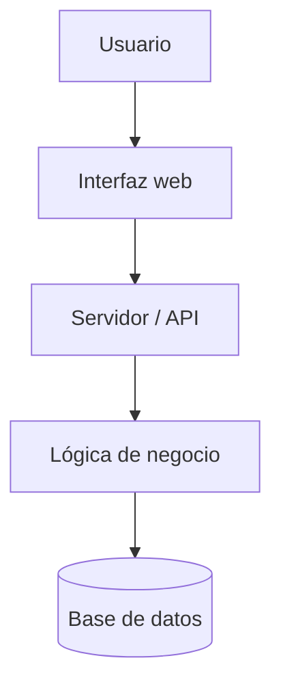

# Biblioteca Fácil

Biblioteca Fácil es una aplicación web que permite gestionar libros de una biblioteca de manera sencilla y organizada.  
Permite registrar libros, consultar su disponibilidad y controlar los préstamos realizados por los usuarios.


## 📋 Tabla de contenidos

- [Descripción](#descripción)
- [Instalación](#instalación)
- [Uso](#uso)
- [Estado de funcionalidades](#estado-de-funcionalidades)
- [Tareas pendientes](#tareas-pendientes)
- [Arquitectura](#arquitectura)
- [Contribuidores](#contribuidores)

## Descripción

Biblioteca Fácil es un proyecto pensado para facilitar la administración de una biblioteca.
La aplicación permite gestionar el catálogo de libros y llevar un control básico de los préstamos.
Su objetivo es ofrecer una interfaz sencilla y fácil de utilizar.

## Instalación

Para instalar y ejecutar el proyecto localmente, sigue estos pasos:

```bash
git clone https://github.com/TU-USUARIO/laboratorio-readme.git
cd laboratorio-readme
npm install
npm start

```
## Uso

Para utilizar el proyecto, ejecuta:

```bash
npm start
```
Luego abre en tu navegador:

```bash
http://localhost:3000
```
Desde la aplicación podrás consultar los libros disponibles, registrar nuevos libros y gestionar préstamos.

## Estado de funcionalidades

| Funcionalidad | Estado |
|---|---|
| Registro de libros | ✅ Completado |
| Consulta de libros | ✅ Completado |
| Búsqueda de libros | ✅ Completado |
| Registro de usuarios | 🚧 En desarrollo |
| Gestión de préstamos | 🚧 En desarrollo |
| Notificaciones de devolución | ❌ Pendiente |

## Tareas pendientes

- [ ] Implementar el registro de usuarios.
- [ ] Completar el sistema de préstamos.
- [ ] Agregar notificaciones de devolución.
- [ ] Crear pruebas automatizadas.
- [ ] Mejorar el diseño de la interfaz.
- [ ] Preparar una versión para producción.

## Arquitectura

El proyecto utiliza una arquitectura sencilla en la que el usuario interactúa con la interfaz web, la cual se comunica con el servidor y la base de datos.


## Contribuidores

### Natteri Luana Choquehuanca Aliaga

- GitHub: [@natteri](https://github.com/natteri-git)
- Rol: Desarrollo y documentación del proyecto.

## Licencia

Este proyecto fue desarrollado con fines educativos.
